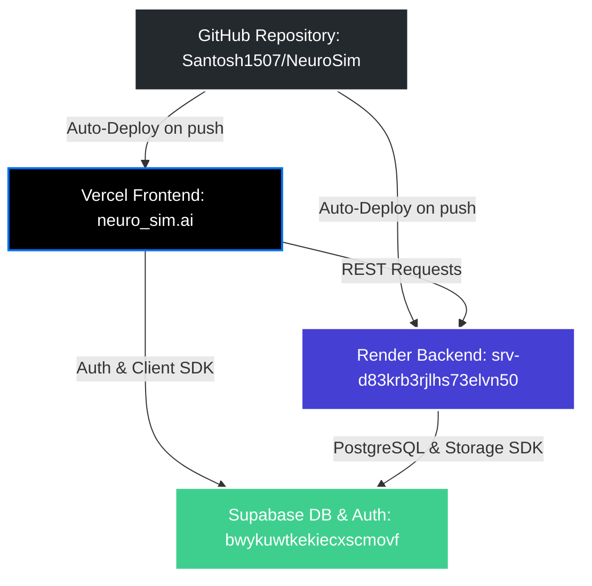

# 🌐 NeuroSim Project Deployment & Connection Hub

This hub contains all official project links, dashboard endpoints, and structural connection diagrams for **NeuroSim**. Use this document as the single source of truth for deployment, CI/CD, database sync, and environment variables.

---

## 🔗 Official Project Links

| Resource | Service / Platform | URL |
| :--- | :--- | :--- |
| **Source Code** | GitHub Repository | [github.com/Santosh1507/NeuroSim](https://github.com/Santosh1507/NeuroSim) |
| **Frontend App** | Vercel Project Dashboard | [vercel.com/skg200257/neuro_sim.ai](https://vercel.com/skg200257/neuro_sim.ai/Dqc5W7FfmLX7eLNvYd4GqSEakCa5) |
| **Backend API** | Render Web Service | [dashboard.render.com/web/srv-d83krb3rjlhs73elvn50](https://dashboard.render.com/web/srv-d83krb3rjlhs73elvn50) |
| **Database & Auth** | Supabase Project | [supabase.com/dashboard/project/bwykuwtkekiecxscmovf](https://supabase.com/dashboard/project/bwykuwtkekiecxscmovf) |

---

## 📐 System Connection Architecture

The following diagram illustrates how the code repo, deployments, database, and client-side layers interact with each other:

---

## ⚙️ Environment Configuration Matrix

To connect everything seamlessly, make sure the following environment variables are set in their respective platform dashboards:

### 1. Vercel (Frontend Dashboard)
Set these variables in your Vercel project environment settings to connect the frontend to the Render backend and Supabase client:

* **`NEXT_PUBLIC_API_URL`**: `https://neurosim-nm22.onrender.com`
* **`NEXT_PUBLIC_SUPABASE_URL`**: `https://bwykuwtkekiecxscmovf.supabase.co`
* **`NEXT_PUBLIC_SUPABASE_ANON_KEY`**: `<set in Vercel dashboard - copy from Supabase Settings > API>`

### 2. Render (Backend Dashboard)
Set these variables in your Render service environment settings to enable the database, JWT verification, and advanced simulation endpoints:

* **`SUPABASE_URL`**: `https://bwykuwtkekiecxscmovf.supabase.co`
* **`SUPABASE_ANON_KEY`**: `<set in Render dashboard - copy from Supabase Settings > API>`
* **`SUPABASE_SERVICE_KEY`**: `<set in Render dashboard - copy from Supabase Settings > API>`
* **`SUPABASE_JWT_SECRET`**: `<set in Render dashboard - copy from Supabase Settings > API > JWT Settings>`
* **`GEMINI_API_KEY`**: `<set in Render dashboard - get from Google AI Studio>`
* **`MIROFISH_USE_REAL`**: `true`
* **`MIROFISH_API_URL`**: `http://localhost:5001` *(or your production MiroFish-Offline/cloud endpoint)*

---

## 🛠️ Local Development Quickstart

To run both servers locally on Windows, double-click or run these helper scripts:
1. **Frontend App** (runs Next.js on `http://localhost:3000`):
   * Run [start-frontend.bat](file:///c:/Users/gandh/Desktop/MiroFish/start-frontend.bat)
2. **Backend API** (runs FastAPI/Uvicorn on `http://127.0.0.1:8001`):
   * Run [start-backend.bat](file:///c:/Users/gandh/Desktop/MiroFish/start-backend.bat)
